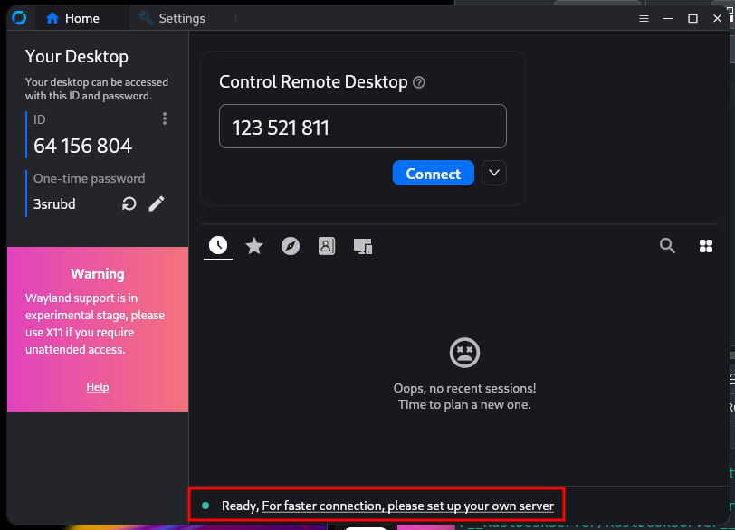
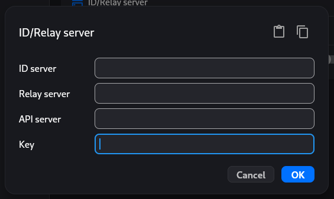
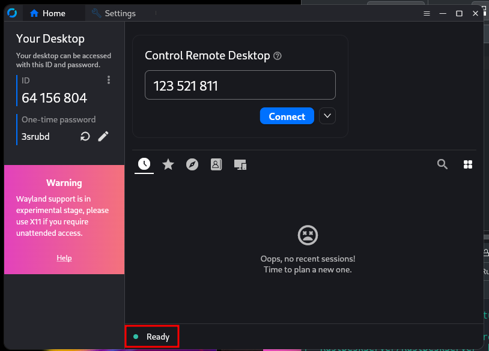

[](https://github.com/michimussato/OpenStudioLandscapes)

***

1. [Feature: OpenStudioLandscapes-RustDeskServer](#feature-openstudiolandscapes-rustdeskserver)
   1. [Brief](#brief)
   2. [Clone](#clone)
      1. [Clone and Install](#clone-and-install)
   3. [Configure](#configure)
      1. [Default Configuration](#default-configuration)
2. [External Resources](#external-resources)
   1. [Rust Desk Server (OSS)](#rust-desk-server-oss)
      1. [RustDesk Setup](#rustdesk-setup)
3. [Community](#community)

***

This `README.md` was dynamically created with [OpenStudioLandscapesUtil-ReadmeGenerator](https://github.com/michimussato/OpenStudioLandscapesUtil-ReadmeGenerator).

***

# Feature: OpenStudioLandscapes-RustDeskServer

## Brief

This is an extension to the OpenStudioLandscapes ecosystem. The full documentation of OpenStudioLandscapes is available [here](https://github.com/michimussato/OpenStudioLandscapes).

> [!NOTE]
> 
> You feel like writing your own Feature? Go and check out the 
> [OpenStudioLandscapes-Template](https://github.com/michimussato/OpenStudioLandscapes-Template).

## Clone

Clone this repository into `OpenStudioLandscapes/.features` (assuming the current working directory to be the Git repository root `./OpenStudioLandscapes`):

```shell
# cd OpenStudioLandscapes
source .venv/bin/activate
openstudiolandscapes clone-feature --repo=https://github.com/michimussato/OpenStudioLandscapes-RustDeskServer.git
deactivate
# Check the resulting console output for installation instructions

```

### Clone and Install

```shell
# cd OpenStudioLandscapes
source .venv/bin/activate
openstudiolandscapes clone-feature --repo=https://github.com/michimussato/OpenStudioLandscapes-RustDeskServer.git \
    && pip install --editable ./.features/OpenStudioLandscapes-RustDeskServer
deactivate

```

For more info on `pip` see [VCS Support of `pip`](https://pip.pypa.io/en/stable/topics/vcs-support/).

## Configure

OpenStudioLandscapes will search for a local config store. The default location is `~/.config/OpenStudioLandscapes/config-store/` but you can specify a different location if you need to.

> [!TIP]
> 
> To specify a config store location different from
> the default location, check out the OpenStudioLandscapes 
> [CLI Section](https://github.com/michimussato/OpenStudioLandscapes#cli)
> to find out how to do that.

A local config store location will be created if it doesn't exist, together with the `config.yml` files for each individual Feature.

> [!TIP]
> 
> The config store root will be initialized as a local Git
> controlled repository. This makes it easy to track changes
> you made to the `config.yml`.

The following settings are available in `OpenStudioLandscapes-RustDeskServer` and are based on [`OpenStudioLandscapes-RustDeskServer/tree/main/OpenStudioLandscapes/RustDeskServer/config/models.py`](https://github.com/michimussato/OpenStudioLandscapes-RustDeskServer/tree/main/OpenStudioLandscapes/RustDeskServer/config/models.py).

### Default Configuration


<details open>
<summary><code>config.yml</code></summary>


```yaml
# ===
# env
# ---
#
# Type: typing.Dict
# Base Class Info:
#     Required:
#         False
#     Description:
#         None
#     Default value:
#         PydanticUndefined
# Description:
#     None
# Required:
#     False
# Examples:
#     None


# ==================
# local_bind_volumes
# ------------------
#
# Type: typing.List[str]
# Base Class Info:
#     Required:
#         False
#     Description:
#         Here you can define Feature specific, arbitrary, absolute bind volume mappings.
#     Default value:
#         PydanticUndefined
# Description:
#     Here you can define Feature specific, arbitrary, absolute bind volume mappings.
# Required:
#     False
# Examples:
#     None


# ===========================
# local_environment_variables
# ---------------------------
#
# Type: typing.Dict[str, str]
# Base Class Info:
#     Required:
#         False
#     Description:
#         Here you can define Feature specific, arbitrary environment variables.
#     Default value:
#         PydanticUndefined
# Description:
#     Here you can define Feature specific, arbitrary environment variables.
# Required:
#     False
# Examples:
#     None


# =============
# config_engine
# -------------
#
# Type: <class 'OpenStudioLandscapes.engine.config.models.ConfigEngine'>
# Base Class Info:
#     Required:
#         False
#     Description:
#         None
#     Default value:
#         None
# Description:
#     None
# Required:
#     False
# Examples:
#     None


# ============
# distribution
# ------------
#
# Type: <class 'importlib.metadata.Distribution'>
# Base Class Info:
#     Required:
#         False
#     Description:
#         None
#     Default value:
#         None
# Description:
#     None
# Required:
#     False
# Examples:
#     None


# ==========
# group_name
# ----------
#
# Type: <class 'str'>
# Base Class Info:
#     Required:
#         True
#     Description:
#         Dagster Group name. This will represent the group node name. See https://docs.dagster.io/api/dagster/assets for more information
#     Default value:
#         PydanticUndefined
# Description:
#     None
# Required:
#     False
# Examples:
#     None
group_name: OpenStudioLandscapes_RustDeskServer


# ============
# key_prefixes
# ------------
#
# Type: typing.List[str]
# Base Class Info:
#     Required:
#         True
#     Description:
#         Dagster Asset key prefixes. This will be reflected in the nesting (directory structure) of the Asset. See https://docs.dagster.io/api/dagster/assets for more information
#     Default value:
#         PydanticUndefined
# Description:
#     None
# Required:
#     False
# Examples:
#     None
key_prefixes:
- OpenStudioLandscapes_RustDeskServer


# =======
# enabled
# -------
#
# Type: <class 'bool'>
# Base Class Info:
#     Required:
#         False
#     Description:
#         Whether the Feature is enabled or not.
#     Default value:
#         True
# Description:
#     Whether the Feature is enabled or not.
# Required:
#     False
# Examples:
#     None


# =============
# compose_scope
# -------------
#
# Type: <class 'str'>
# Base Class Info:
#     Required:
#         False
#     Description:
#         None
#     Default value:
#         default
# Description:
#     None
# Required:
#     False
# Examples:
#     ['default', 'license_server', 'worker']


# ============
# feature_name
# ------------
#
# Type: <class 'str'>
# Base Class Info:
#     Required:
#         True
#     Description:
#         The name of the feature. It is derived from the `OpenStudioLandscapes.<Feature>.dist` attribute.
#     Default value:
#         PydanticUndefined
# Description:
#     None
# Required:
#     False
# Examples:
#     None
feature_name: OpenStudioLandscapes-RustDeskServer


# ==============
# docker_compose
# --------------
#
# Type: <class 'pathlib.Path'>
# Base Class Info:
#     Required:
#         False
#     Description:
#         The path to the `docker-compose.yml` file.
#     Default value:
#         {DOT_LANDSCAPES}/{LANDSCAPE}/{FEATURE}/docker_compose/docker-compose.yml
# Description:
#     The path to the `docker-compose.yml` file.
# Required:
#     False
# Examples:
#     None


# ===========================
# rustdeskserver_docker_image
# ---------------------------
#
# Type: <class 'str'>
# Description:
#     None
# Required:
#     False
# Examples:
#     None
rustdeskserver_docker_image: docker.io/rustdesk/rustdesk-server:latest


# ====================================
# rustdeskserver_HBBS_ALWAYS_USE_RELAY
# ------------------------------------
#
# Type: <class 'str'>
# Description:
#     None
# Required:
#     False
# Examples:
#     ['Y', 'N']
rustdeskserver_HBBS_ALWAYS_USE_RELAY: Y


# =========================================
# rustdeskserver_HBBS_WEB_CONSOLE_PORT_HOST
# -----------------------------------------
#
# Type: <class 'int'>
# Description:
#     Only in Pro version.
# Required:
#     False
# Examples:
#     None
rustdeskserver_HBBS_WEB_CONSOLE_PORT_HOST: 21114


# ==============================================
# rustdeskserver_HBBS_WEB_CONSOLE_PORT_CONTAINER
# ----------------------------------------------
#
# Type: <class 'int'>
# Description:
#     Only in Pro version.
# Required:
#     False
# Examples:
#     None
rustdeskserver_HBBS_WEB_CONSOLE_PORT_CONTAINER: 21114


# ===========================================
# rustdeskserver_HBBS_NAT_TYPE_TEST_PORT_HOST
# -------------------------------------------
#
# Type: <class 'int'>
# Description:
#     None
# Required:
#     False
# Examples:
#     None
rustdeskserver_HBBS_NAT_TYPE_TEST_PORT_HOST: 21115


# ================================================
# rustdeskserver_HBBS_NAT_TYPE_TEST_PORT_CONTAINER
# ------------------------------------------------
#
# Type: <class 'int'>
# Description:
#     None
# Required:
#     False
# Examples:
#     None
rustdeskserver_HBBS_NAT_TYPE_TEST_PORT_CONTAINER: 21115


# ===========================================================
# rustdeskserver_HBBS_ID_REGISTRATION_HEARTBEAT_TCP_PORT_HOST
# -----------------------------------------------------------
#
# Type: <class 'int'>
# Description:
#     None
# Required:
#     False
# Examples:
#     None
rustdeskserver_HBBS_ID_REGISTRATION_HEARTBEAT_TCP_PORT_HOST: 21116


# ================================================================
# rustdeskserver_HBBS_ID_REGISTRATION_HEARTBEAT_TCP_PORT_CONTAINER
# ----------------------------------------------------------------
#
# Type: <class 'int'>
# Description:
#     None
# Required:
#     False
# Examples:
#     None
rustdeskserver_HBBS_ID_REGISTRATION_HEARTBEAT_TCP_PORT_CONTAINER: 21116


# ===========================================================
# rustdeskserver_HBBS_ID_REGISTRATION_HEARTBEAT_UDP_PORT_HOST
# -----------------------------------------------------------
#
# Type: <class 'int'>
# Description:
#     None
# Required:
#     False
# Examples:
#     None
rustdeskserver_HBBS_ID_REGISTRATION_HEARTBEAT_UDP_PORT_HOST: 21116


# ================================================================
# rustdeskserver_HBBS_ID_REGISTRATION_HEARTBEAT_UDP_PORT_CONTAINER
# ----------------------------------------------------------------
#
# Type: <class 'int'>
# Description:
#     None
# Required:
#     False
# Examples:
#     None
rustdeskserver_HBBS_ID_REGISTRATION_HEARTBEAT_UDP_PORT_CONTAINER: 21116


# =================================================
# rustdeskserver_HBBS_WEB_CLIENTS_SUPPORT_PORT_HOST
# -------------------------------------------------
#
# Type: <class 'int'>
# Description:
#     Can be disabled if web clients are not needed.
# Required:
#     False
# Examples:
#     None
rustdeskserver_HBBS_WEB_CLIENTS_SUPPORT_PORT_HOST: 21118


# ======================================================
# rustdeskserver_HBBS_WEB_CLIENTS_SUPPORT_PORT_CONTAINER
# ------------------------------------------------------
#
# Type: <class 'int'>
# Description:
#     Can be disabled if web clients are not needed.
# Required:
#     False
# Examples:
#     None
rustdeskserver_HBBS_WEB_CLIENTS_SUPPORT_PORT_CONTAINER: 21118


# ============================================
# rustdeskserver_HBBR_RELAY_SERVICES_PORT_HOST
# --------------------------------------------
#
# Type: <class 'int'>
# Description:
#     None
# Required:
#     False
# Examples:
#     None
rustdeskserver_HBBR_RELAY_SERVICES_PORT_HOST: 21117


# =================================================
# rustdeskserver_HBBR_RELAY_SERVICES_PORT_CONTAINER
# -------------------------------------------------
#
# Type: <class 'int'>
# Description:
#     None
# Required:
#     False
# Examples:
#     None
rustdeskserver_HBBR_RELAY_SERVICES_PORT_CONTAINER: 21117


# ======================================================
# rustdeskserver_HBBR_WEB_CLIENTS_SUPPORT_PORT_CONTAINER
# ------------------------------------------------------
#
# Type: <class 'int'>
# Description:
#     Can be disabled if web clients are not needed.
# Required:
#     False
# Examples:
#     None
rustdeskserver_HBBR_WEB_CLIENTS_SUPPORT_PORT_CONTAINER: 21119


# =================================================
# rustdeskserver_HBBR_WEB_CLIENTS_SUPPORT_PORT_HOST
# -------------------------------------------------
#
# Type: <class 'int'>
# Description:
#     Can be disabled if web clients are not needed.
# Required:
#     False
# Examples:
#     None
rustdeskserver_HBBR_WEB_CLIENTS_SUPPORT_PORT_HOST: 21119


# =========================
# rustdeskserver_data_store
# -------------------------
#
# Type: <class 'pathlib.Path'>
# Description:
#     None
# Required:
#     False
# Examples:
#     None
rustdeskserver_data_store: '{DOT_LANDSCAPES}/{LANDSCAPE}/{FEATURE}/data'
```


</details>


***

# External Resources

[](https://rustdesk.com/)

## Rust Desk Server (OSS)

Rust Desk Server Information:

- [Github](https://github.com/rustdesk/rustdesk)
- [RustDesk Server (OSS)](https://github.com/rustdesk/rustdesk-server/releases/latest)
- [RustDesk Server (Pro)](https://github.com/rustdesk/rustdesk-server-pro/releases/latest)
- [Documentation](https://rustdesk.com/docs/en/self-host/rustdesk-server-oss/docker/)
- [Tutorial/Overview (Network Chuck)](https://www.youtube.com/watch?v=EXL8mMUXs88&ab_channel=NetworkChuck)
- [Build Docker Image](https://github.com/rustdesk/rustdesk?tab=readme-ov-file#how-to-build-with-docker)

### RustDesk Setup

#### Client Installation

RustDesk Clients are available for a variety of platforms. Take a look at the documentation for more information:

- [RustDesk Client](https://rustdesk.com/docs/en/client/)

#### Client Setup

When you run RustDesk Client (aka RustDesk Desktop), you'll be presented with a screen similar to this one:



If the screen shows you the message highlighted in red, saying **Ready, For faster connection, please set up your own server**, it means that you are using RustDesks proprietary Relay Server. So let's switch to the **OpenStudioLandscapes-RustDeskServer** Relay Server:

1. Open Settings
2. Go to Network
3. Unlock network settings
4. Open ID/Relay server



`ID server` and `Relay server` specify the host name or IP address the RustDesk Server is running on (this could be `localhost` in case the Landscape with OpenStudioLandscapes-RustDeskServer Feature is running on your local machine).

`API server` can be left blank as it is only relevant in the Pro version.

`Key` can be derived from the following local file:

> [!WARNING]
>
> Only share the key from the file with the `.pub`
> extension with others!            

`.landscapes/<landscape_id>/RustDeskServer__RustDeskServer/data/id_ed25519.pub `

It's content looks similar to this:

`6eU9lygBsQ5JExSvipkVlAsAlcYfKFEgEgdxzNP72SE= `

Copy/paste the full content into the `Key` field of the ID/Relay server window.

Your RustDesk screen should now display a different message and you have successfully configured RustDesk Client to use your local **OpenStudioLandscapes-RustDeskServer** server.



Repeat this procedure for all your clients and you are good to go to connect from one client to another using your own RustDesk Relay Server.

***

# Community

| Feature                                   | GitHub                                                                                                                                                 | Discord                                                                      |
| ----------------------------------------- | ------------------------------------------------------------------------------------------------------------------------------------------------------ | ---------------------------------------------------------------------------- |
| OpenStudioLandscapes                      | [https://github.com/michimussato/OpenStudioLandscapes](https://github.com/michimussato/OpenStudioLandscapes)                                           | [# openstudiolandscapes-general](https://discord.gg/F6bDRWsHac)              |
| OpenStudioLandscapes-Ayon                 | [https://github.com/michimussato/OpenStudioLandscapes-Ayon](https://github.com/michimussato/OpenStudioLandscapes-Ayon)                                 | [# openstudiolandscapes-ayon](https://discord.gg/gd6etWAF3v)                 |
| OpenStudioLandscapes-Dagster              | [https://github.com/michimussato/OpenStudioLandscapes-Dagster](https://github.com/michimussato/OpenStudioLandscapes-Dagster)                           | [# openstudiolandscapes-dagster](https://discord.gg/jwB3DwmKvs)              |
| OpenStudioLandscapes-Deadline-10-2        | [https://github.com/michimussato/OpenStudioLandscapes-Deadline-10-2](https://github.com/michimussato/OpenStudioLandscapes-Deadline-10-2)               | [# openstudiolandscapes-deadline-10-2](https://discord.gg/p2UjxHk4Y3)        |
| OpenStudioLandscapes-Deadline-10-2-Worker | [https://github.com/michimussato/OpenStudioLandscapes-Deadline-10-2-Worker](https://github.com/michimussato/OpenStudioLandscapes-Deadline-10-2-Worker) | [# openstudiolandscapes-deadline-10-2-worker](https://discord.gg/ttkbfkzUmf) |
| OpenStudioLandscapes-Flamenco             | [https://github.com/michimussato/OpenStudioLandscapes-Flamenco](https://github.com/michimussato/OpenStudioLandscapes-Flamenco)                         | [# openstudiolandscapes-flamenco](https://discord.gg/EPrX5fzBCf)             |
| OpenStudioLandscapes-Flamenco-Worker      | [https://github.com/michimussato/OpenStudioLandscapes-Flamenco-Worker](https://github.com/michimussato/OpenStudioLandscapes-Flamenco-Worker)           | [# openstudiolandscapes-flamenco-worker](https://discord.gg/Sa2zFqSc4p)      |
| OpenStudioLandscapes-Grafana              | [https://github.com/michimussato/OpenStudioLandscapes-Grafana](https://github.com/michimussato/OpenStudioLandscapes-Grafana)                           | [# openstudiolandscapes-grafana](https://discord.gg/gEDQ8vJWDb)              |
| OpenStudioLandscapes-Kitsu                | [https://github.com/michimussato/OpenStudioLandscapes-Kitsu](https://github.com/michimussato/OpenStudioLandscapes-Kitsu)                               | [# openstudiolandscapes-kitsu](https://discord.gg/6cc6mkReJ7)                |
| OpenStudioLandscapes-LikeC4               | [https://github.com/michimussato/OpenStudioLandscapes-LikeC4](https://github.com/michimussato/OpenStudioLandscapes-LikeC4)                             | [# openstudiolandscapes-likec4](https://discord.gg/qAYYsKYF6V)               |
| OpenStudioLandscapes-OpenCue              | [https://github.com/michimussato/OpenStudioLandscapes-OpenCue](https://github.com/michimussato/OpenStudioLandscapes-OpenCue)                           | [# openstudiolandscapes-opencue](https://discord.gg/3DdCZKkVyZ)              |
| OpenStudioLandscapes-OpenCue-Worker       | [https://github.com/michimussato/OpenStudioLandscapes-OpenCue-Worker](https://github.com/michimussato/OpenStudioLandscapes-OpenCue-Worker)             | [# openstudiolandscapes-opencue-worker](https://discord.gg/n9fxxhHa3V)       |
| OpenStudioLandscapes-RustDeskServer       | [https://github.com/michimussato/OpenStudioLandscapes-RustDeskServer](https://github.com/michimussato/OpenStudioLandscapes-RustDeskServer)             | [# openstudiolandscapes-rustdeskserver](https://discord.gg/nJ8Ffd2xY3)       |
| OpenStudioLandscapes-Syncthing            | [https://github.com/michimussato/OpenStudioLandscapes-Syncthing](https://github.com/michimussato/OpenStudioLandscapes-Syncthing)                       | [# openstudiolandscapes-syncthing](https://discord.gg/upb9MCqb3X)            |
| OpenStudioLandscapes-Template             | [https://github.com/michimussato/OpenStudioLandscapes-Template](https://github.com/michimussato/OpenStudioLandscapes-Template)                         | [# openstudiolandscapes-template](https://discord.gg/J59GYp3Wpy)             |
| OpenStudioLandscapes-VERT                 | [https://github.com/michimussato/OpenStudioLandscapes-VERT](https://github.com/michimussato/OpenStudioLandscapes-VERT)                                 | [# openstudiolandscapes-vert](https://discord.gg/EPrX5fzBCf)                 |
| OpenStudioLandscapes-filebrowser          | [https://github.com/michimussato/OpenStudioLandscapes-filebrowser](https://github.com/michimussato/OpenStudioLandscapes-filebrowser)                   | [# openstudiolandscapes-filebrowser](https://discord.gg/stzNsZBmwk)          |
| OpenStudioLandscapes-n8n                  | [https://github.com/michimussato/OpenStudioLandscapes-n8n](https://github.com/michimussato/OpenStudioLandscapes-n8n)                                   | [# openstudiolandscapes-n8n](https://discord.gg/yFYrG999wE)                  |

To follow up on the previous LinkedIn publications, visit:

- [OpenStudioLandscapes on LinkedIn](https://www.linkedin.com/company/106731439/).
- [Search for tag #OpenStudioLandscapes on LinkedIn](https://www.linkedin.com/search/results/all/?keywords=%23openstudiolandscapes).

***

Last changed: **2026-02-18 00:27:38 UTC**