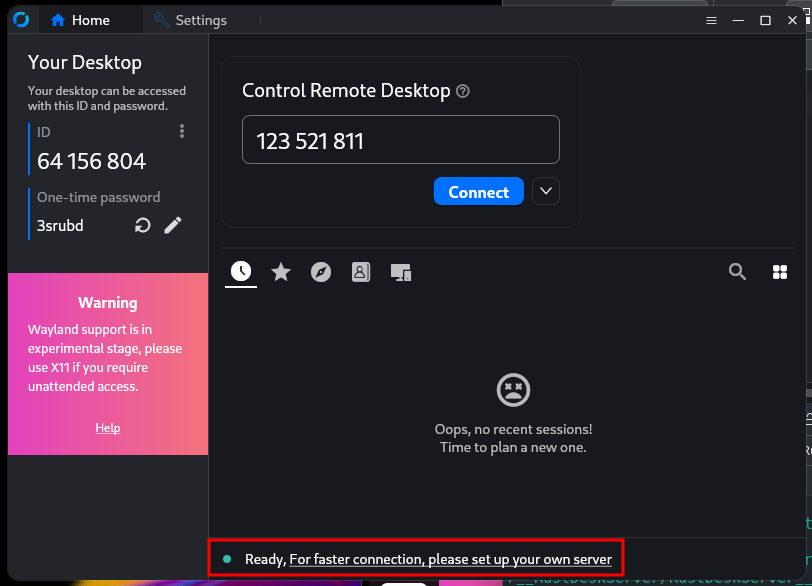
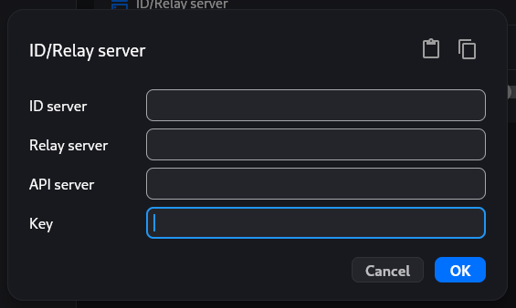
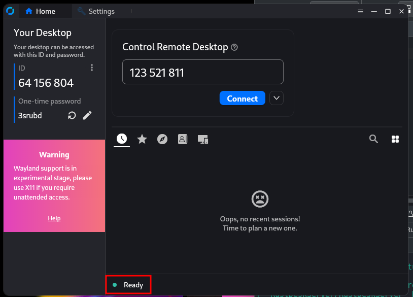

[](https://github.com/michimussato/OpenStudioLandscapes)

***

1. [Feature: OpenStudioLandscapes-RustDeskServer](#feature-openstudiolandscapes-rustdeskserver)
   1. [Brief](#brief)
   2. [Requirements](#requirements)
   3. [Install](#install)
      1. [This Feature](#this-feature)
   4. [Add to OpenStudioLandscapes](#add-to-openstudiolandscapes)
   5. [Testing](#testing)
      1. [pre-commit](#pre-commit)
      2. [nox](#nox)
   6. [Variables](#variables)
      1. [Feature Configs](#feature-configs)
2. [Community](#community)
3. [Official Resources](#official-resources)
   1. [Rust Desk Server (OSS)](#rust-desk-server-oss)
      1. [RustDesk Setup](#rustdesk-setup)

***

This `README.md` was dynamically created with [OpenStudioLandscapesUtil-ReadmeGenerator](https://github.com/michimussato/OpenStudioLandscapesUtil-ReadmeGenerator).

***

# Feature: OpenStudioLandscapes-RustDeskServer

## Brief

This is an extension to the OpenStudioLandscapes ecosystem. The full documentation of OpenStudioLandscapes is available [here](https://github.com/michimussato/OpenStudioLandscapes).

You feel like writing your own Feature? Go and check out the [OpenStudioLandscapes-Template](https://github.com/michimussato/OpenStudioLandscapes-Template).

## Requirements

- `python-3.11`
- `OpenStudioLandscapes`

## Install

### This Feature

Clone this repository into `OpenStudioLandscapes/.features`:

```shell

# cd .features
git clone https://github.com/michimussato/OpenStudioLandscapes-RustDeskServer.git

```

Create `venv`:

```shell

# cd .features/OpenStudioLandscapes-RustDeskServer
python3.11 -m venv .venv
source .venv/bin/activate
python -m pip install --upgrade pip setuptools

```

Configure `venv`:

```shell

# cd .features/OpenStudioLandscapes-RustDeskServer
pip install -e "../../[dev]"
pip install -e ".[dev]"

```

For more info see [VCS Support of pip](https://pip.pypa.io/en/stable/topics/vcs-support/).

## Add to OpenStudioLandscapes

Add the following code to `OpenStudioLandscapes.engine.features.FEATURES`:

```python

FEATURES.update(
    "OpenStudioLandscapes-RustDeskServer": {
        "enabled": True|False,
        # - from ENVIRONMENT VARIABLE (.env):
        #   "enabled": get_bool_env("ENV_VAR")
        # - combined:
        #   "enabled": True|False or get_bool_env(
        #       "OPENSTUDIOLANDSCAPES__ENABLE_FEATURE_OPENSTUDIOLANDSCAPES_RUSTDESKSERVER"
        #   )
        "module": "OpenStudioLandscapes.RustDeskServer.definitions",
        "compose_scope": ComposeScope.DEFAULT,
        "feature_config": OpenStudioLandscapesConfig.DEFAULT,
    }
)

```

## Testing

### pre-commit

- https://pre-commit.com
- https://pre-commit.com/hooks.html

```shell

pre-commit install

```

### nox

#### Generate Report

```shell

nox --no-error-on-missing-interpreters --report .nox/nox-report.json

```

#### Re-Generate this README

```shell

nox -v --add-timestamp --session readme

```

#### Generate Sphinx Documentation

```shell

nox -v --add-timestamp --session docs

```

#### pylint

```shell

nox -v --add-timestamp --session lint

```

##### pylint: disable=redefined-outer-name

- [`W0621`](https://pylint.pycqa.org/en/latest/user_guide/messages/warning/redefined-outer-name.html): Due to Dagsters way of piping arguments into assets.

#### SBOM

Acronym for Software Bill of Materials

```shell

nox -v --add-timestamp --session sbom

```

We create the following SBOMs:

- [`cyclonedx-bom`](https://pypi.org/project/cyclonedx-bom/)
- [`pipdeptree`](https://pypi.org/project/pipdeptree/) (Dot)
- [`pipdeptree`](https://pypi.org/project/pipdeptree/) (Mermaid)

SBOMs for the different Python interpreters defined in [`.noxfile.VERSIONS`](https://github.com/michimussato/OpenStudioLandscapes-RustDeskServer/tree/main/noxfile.py) will be created in the [`.sbom`](https://github.com/michimussato/OpenStudioLandscapes-RustDeskServer/tree/main/.sbom) directory of this repository.

- `cyclone-dx`
- `pipdeptree` (Dot)
- `pipdeptree` (Mermaid)

Currently, the following Python interpreters are enabled for testing:

- `python3.11`

## Variables

The following variables are being declared in `OpenStudioLandscapes.RustDeskServer.constants` and are accessible throughout the [`OpenStudioLandscapes-RustDeskServer`](https://github.com/michimussato/OpenStudioLandscapes-RustDeskServer/tree/main/src/OpenStudioLandscapes/RustDeskServer/constants.py) package.

| Variable           | Type   |
| :----------------- | :----- |
| `DOCKER_USE_CACHE` | `bool` |
| `ASSET_HEADER`     | `dict` |
| `FEATURE_CONFIGS`  | `dict` |

### Feature Configs

#### Feature Config: default

| Variable                                            | Type   | Value                                                              |
| :-------------------------------------------------- | :----- | :----------------------------------------------------------------- |
| `DOCKER_USE_CACHE`                                  | `bool` | `False`                                                            |
| `HBBS_ALWAYS_USE_RELAY`                             | `str`  | `Y`                                                                |
| `HBBS_WEB_CONSOLE_PORT_HOST`                        | `str`  | `21114`                                                            |
| `HBBS_WEB_CONSOLE_PORT_CONTAINER`                   | `str`  | `21114/tcp`                                                        |
| `HBBS_NAT_TYPE_TEST_PORT_HOST`                      | `str`  | `21115`                                                            |
| `HBBS_NAT_TYPE_TEST_PORT_CONTAINER`                 | `str`  | `21115/tcp`                                                        |
| `HBBS_ID_REGISTRATION_HEARTBEAT_TCP_PORT_HOST`      | `str`  | `21116`                                                            |
| `HBBS_ID_REGISTRATION_HEARTBEAT_TCP_PORT_CONTAINER` | `str`  | `21116/tcp`                                                        |
| `HBBS_ID_REGISTRATION_HEARTBEAT_UDP_PORT_HOST`      | `str`  | `21116`                                                            |
| `HBBS_ID_REGISTRATION_HEARTBEAT_UDP_PORT_CONTAINER` | `str`  | `21116/udp`                                                        |
| `HBBS_WEB_CLIENTS_SUPPORT_PORT_HOST`                | `str`  | `21118`                                                            |
| `HBBS_WEB_CLIENTS_SUPPORT_PORT_CONTAINER`           | `str`  | `21118/tcp`                                                        |
| `HBBR_RELAY_SERVICES_PORT_HOST`                     | `str`  | `21117`                                                            |
| `HBBR_RELAY_SERVICES_PORT_CONTAINER`                | `str`  | `21117/tcp`                                                        |
| `HBBR_WEB_CLIENTS_SUPPORT_PORT_CONTAINER`           | `str`  | `21119`                                                            |
| `HBBR_WEB_CLIENTS_SUPPORT_PORT_HOST`                | `str`  | `21119/tcp`                                                        |
| `DATA_STORE`                                        | `str`  | `{DOT_LANDSCAPES}/{LANDSCAPE}/RustDeskServer__RustDeskServer/data` |

# Community

| Feature                      | GitHub                                                                                                                       | Discord                                                               |
| ---------------------------- | ---------------------------------------------------------------------------------------------------------------------------- | --------------------------------------------------------------------- |
| OpenStudioLandscapes         | [https://github.com/michimussato/OpenStudioLandscapes](https://github.com/michimussato/OpenStudioLandscapes)                 | [# openstudiolandscapes-general](https://discord.com/invite/aYnJnaqE) |
| OpenStudioLandscapes-Ayon    | [https://github.com/michimussato/OpenStudioLandscapes-Ayon](https://github.com/michimussato/OpenStudioLandscapes-Ayon)       | [# openstudiolandscapes-ayon](https://discord.gg/D4XrG99G)            |
| OpenStudioLandscapes-Dagster | [https://github.com/michimussato/OpenStudioLandscapes-Dagster](https://github.com/michimussato/OpenStudioLandscapes-Dagster) | [# openstudiolandscapes-dagster](https://discord.gg/qFGWTWu4)         |
| OpenStudioLandscapes-Kitsu   | [https://github.com/michimussato/OpenStudioLandscapes-Kitsu](https://github.com/michimussato/OpenStudioLandscapes-Kitsu)     | [# openstudiolandscapes-kitsu](https://discord.gg/4UqHdsan)           |

To follow up on the previous LinkedIn publications, visit:

- [OpenStudioLandscapes on LinkedIn](https://www.linkedin.com/company/106731439/).
- [Search for tag #OpenStudioLandscapes on LinkedIn](https://www.linkedin.com/search/results/all/?keywords=%23openstudiolandscapes).

***

# Official Resources

[](https://rustdesk.com/)

## Rust Desk Server (OSS)

Rust Desk Server Information:

- [Github](https://github.com/rustdesk/rustdesk)
- [RustDesk Server (OSS)](https://github.com/rustdesk/rustdesk-server/releases/latest)
- [RustDesk Server (Pro)](https://github.com/rustdesk/rustdesk-server-pro/releases/latest)
- [Documentation](https://rustdesk.com/docs/en/self-host/rustdesk-server-oss/docker/)
- [Tutorial/Overview (Network Chuck)](https://www.youtube.com/watch?v=EXL8mMUXs88&ab_channel=NetworkChuck)
- [Build Docker Image](https://github.com/rustdesk/rustdesk?tab=readme-ov-file#how-to-build-with-docker)

### RustDesk Setup

#### Client Installation

RustDesk Clients are available for a variety of platforms. Take a look at the documentation for more information:

- [RustDesk Client](https://rustdesk.com/docs/en/client/)

#### Client Setup

When you run RustDesk Client (aka RustDesk Desktop), you'll be presented with a screen similar to this one:



If the screen shows you the message highlighted in red, saying **Ready, For faster connection, please set up your own server**, it means that you are using RustDesks proprietary Relay Server. So let's switch to the **OpenStudioLandscapes-RustDeskServer** Relay Server:

1. Open Settings
2. Go to Network
3. Unlock network settings
4. Open ID/Relay server



`ID server` and `Relay server` specify the host name or IP address the RustDesk Server is running on (this could be `localhost` in case the Landscape with OpenStudioLandscapes-RustDeskServer Feature is running on your local machine).

`API server` can be left blank as it is only relevant in the Pro version.

`Key` can be derived from the following local file:

**IMPORTANT: Only share the key from the file with the `.pub` extension with others!**

`.landscapes/<landscape_id>/RustDeskServer__RustDeskServer/data/id_ed25519.pub `

It's content looks similar to this:

`6eU9lygBsQ5JExSvipkVlAsAlcYfKFEgEgdxzNP72SE= `

Copy/paste the full content into the `Key` field of the ID/Relay server window.

Your RustDesk screen should now display a different message and you have successfully configured RustDesk Client to use your local **OpenStudioLandscapes-RustDeskServer** server.



Repeat this procedure for all your clients and you are good to go to connect from one client to another using your own RustDesk Relay Server.